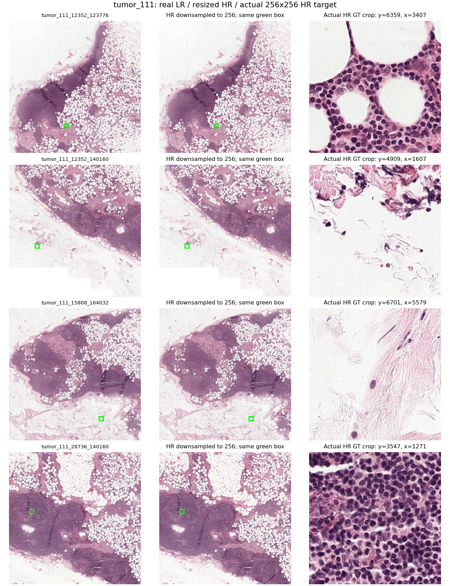

# tumor_111：D4 真实图片与 Meta-SR 裁剪坐标审计

## 结论

2026-09-30，使用 `D:\ddata` 的四对真实图片、`configs/rdn_d4.yaml`，完成真实 CUDA BF16 整批训练路径检查，以及独立 FP64 解码/梯度验证。现有检查未发现配错区域、裁剪原点重置、行列颠倒或边界拼接错误。

代码级证据支持：预测 crop 的每个像素使用与 GT crop 相同的区域编号和绝对 HR 坐标。图片级证据支持：四对导出 JPEG 的空间内容与 32 倍比例吻合。但没有原始 WSI 和导出脚本，不能把这些结果写成原始提取过程的严格亚 HR 像素配准证明。

## 实际数据流

整张 LR `[4,3,256,256]` → 浅层卷积 → 4 个 RDB → GFF 融合及残差 → `[4,64,256,256]`。

这份融合后的 RDN 特征同时用于 ResNet 分类分支和 Meta-SR 分支。真实 HR crop 是监督目标；Meta-SR 根据同一区域的特征生成预测 crop。GT 不输入 RDN 或 Pos2Weight。

对于每个区域 `i`：

1. 从该区域 8192×8192 HR 图按 `(y,x,h,w)` 裁 GT。PIL 接口转换为 `(x,y,x+w,y+h)`。
2. 将同一 `(y,x,h,w)` 传给 `decode_crop(feature[i:i+1], box)`。
3. 输出局部位置 `(u,v)` 对应绝对 HR 坐标 `(Y,X)=(y+u,x+v)`。
4. 特征中心为 `(Y//32,X//32)`，取其 3×3×64 邻域；Pos2Weight 输入 `(1/32,(Y%32)/32,(X%32)/32)` 生成 RGB 重建核。
5. 两个坐标中的整数部分定位特征，余数定位 32×32 子像素位置；没有把 crop 的左上角重新设成整幅 HR 的原点。
6. 四项 SR L1 取平均，与完整 WSI 的分类 CE 合成损失，统一反向和更新。

第一对本次裁剪框为 `(6359,3407,256,256)`：左上角映射到特征中心 `(198,106)`，子像素余数为 `(23,15)`。完整 crop 覆盖特征中心 y=198..206、x=106..114，共 9×9 个中心；因为裁剪起点不是 32 的整数倍，不能简单取某个 8×8 特征块后把偏移归零。每个中心还使用 3×3 邻域，RDN 特征自身有更大的感受野。

## 当前四对导出图片检查

HR 用 LANCZOS 缩小到 256 后与真实 LR 比较。MAE 单位为 0–255 像素值。

| 文件坐标后缀 | RGB 相关系数 | MAE | ±4 LR 像素平移搜索的最佳偏移 |
|---|---:|---:|---|
| 12352_123776 | 0.994212 | 3.9603 | (0,0) |
| 12352_140160 | 0.994835 | 3.3705 | (0,0) |
| 15808_164032 | 0.994031 | 4.1590 | (0,0) |
| 28736_140160 | 0.994377 | 4.4365 | (0,0) |

全部 4×4 图片交叉配对中，同名配对 MAE 最小；翻转、转置和旋转后的 MAE 均明显更大。JPEG 编码及下采样差异意味着两个 256 图并非逐像素相同。

还检查了四个实际裁剪位置覆盖的局部 LR 网格，与 HR 缩小图比较，相关系数分别为 0.9861、0.9860、0.9363、0.9820，MAE 分别为 6.99、3.92、3.29、3.63。局部窗口只有 9×9 像素，第三处位于较浅组织/背景区域；这些指标是局部一致性证据，不能当作精确配准证明。



每行对应一个区域。左列是实际 LR，中列是 HR 缩小图，绿框为本次裁剪位置；右列是实际 HR 监督 crop，不是模型预测图。

## CUDA 训练中的实时检查

- 在真实 `engine.wsi_loss` 内包装实际读取和解码调用，不替换真实图片、坐标或模型输出。
- 确认只做一次 `[4,3,256,256]` 整批编码、一次 `[4,512]` 完整袋子聚合。
- 四次解码逐一确认 region 特征一致、同一个绝对 box、feature 保留 grad_fn。
- 每个实际 GT crop 与独立 NumPy `hr[y:y+h,x:x+w]` 全像素比较，最大误差均为 **0**。
- 独立重算四项 SR L1 的平均值，与训练 SR loss 相同：**0.756476640701294**。
- 本次坐标及三项 loss 与之前 N=4 冒烟记录相同；完成 backward 和 Adam step，梯度有限，RDN/P2W/ABMIL 梯度非零。

## 独立解码与梯度检查

使用这次 CUDA 从真实 LR 提取的特征，转 FP64 隔离低精度舍入影响。独立参考手动按通道及 3×3 邻域取值，不使用被测实现的 unfold、tiles 或 position_table；按绝对坐标直接构造 Pos2Weight 输入。

- 四个实际 crop 的 **262,144 个像素、786,432 个 RGB 标量全部比较**，最大绝对差 **6.21725e-15**。
- 另检查左上角、右下角及非 32 对齐框，每框 64 个点，覆盖边缘补零及子像素切换。
- 故意交换 x/y、偏移 1 HR 像素、偏移 1 LR 像素、把 crop 原点错误归零，四种负对照均被拒绝。
- 在真实特征的选定像素上，对比 SR-only 标量损失传回 feature 和全部 P2W 参数的梯度，最大绝对差 **4.99601e-16**。
- 比较阈值固定为 atol=1e-10、rtol=1e-10；未因失败放宽。FP64 结果验证坐标/布局，不宣称 BF16 与 FP64 数值等价。

## 复查与证据边界

```powershell
& D:\conda\envs\clam_latest\python.exe -u -B audit\check_tumor_d4_alignment.py
```

原始检查见 `report.json`、`image_pair_checks.json`、`crop_local_image_checks.json`。训练模型与配置未为这次审计修改。

当前图像加载没有几何增强；若以后开启旋转/翻转，需要重新检查成对变换。要追溯原始 WSI 的提取位置、金字塔层级和下采样中心约定，还需要生成这些配对图片的脚本或相应原始元数据。
